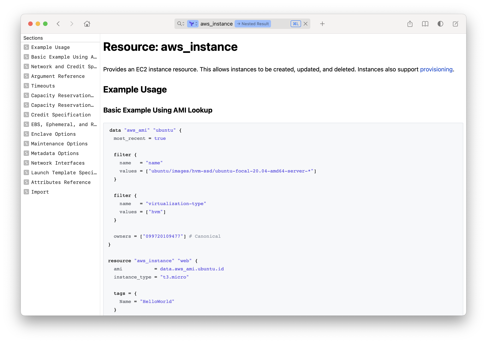

dash-docset-terraform
=====================

# Overview

_[Terraform](https://www.terraform.io) docset for the [Dash](https://kapeli.com/dash) documentation browser._

This docset is available as a User-Contributed Docset. Download it from Dash directly.

Generated from [Terraform Registry](https://registry.terraform.io) and various provider repositories.

Instructions for building Dash docsets are available on the [Dash website](https://kapeli.com/docsets#dashDocset).

The official version of Terraform documentation is hosted [here](https://www.terraform.io/docs).

_The maintainer of this repository is not affiliated with HashiCorp._



## How to Build

The system must provide the following:

- bash
- git
- GNU Make
- Python 3.9

To build the docset, run:

```bash
make docset
```

The build will use the version of Terraform given in [version/terraform]. All
providers will use their latest versions.

The docset will be available at `.build/latest/Terraform.docset`, along with a
compressed variant at `.build/latest/Terraform.tgz`.
